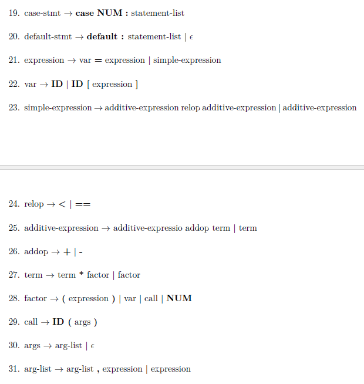

# NC-Minus-Compiler-Project
This project consists of implementing a onepass error-handler compiler for a simplified version of C language with nested function programming added to it. The compiler consists of lexical analyser (scanner), semantic analyser (parser), error-handler, semantic analyser and intermediate code generator. The following is the grammer of this language:

